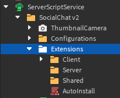

# The Basics

Before using Social Chat, it is recommended that you at least have a minimal understanding of Roblox's [**Client-Server Model**](https://create.roblox.com/docs/projects/client-server), [**Object Oriented
Programming**](https://devforum.roblox.com/t/all-about-object-oriented-programming/8585), and a basic understanding of how scripting works.

To get started, create a script (Client or Server) and **`require`** the asset from [**`ReplicatedStorage`**](https://create.roblox.com/docs/reference/engine/classes/ReplicatedStorage) as follows:
```lua
local SocialChat = require(game.ReplicatedStorage:WaitForChild("SocialChat"));
```

SocialChat's API sits within a [**`ModuleScript`**](https://create.roblox.com/docs/reference/engine/classes/ModuleScript), hence why we must require it. Doing so will return the following:
```lua title="SocialChat Module Data:"
{
  ["Extensions"] = {...}, -- These can only be viewed on the client. The server will see an empty array
  ["Library"] = {...}, -- Library Modules used by your current environment.
  ["Settings"] = {...}, -- SocialChat configurations for your given environment. The Server can see client configurations
  ["Src"] = {...} -- The source array that holds all SocialChat components.
};
```

:::caution
Based on your environment, you may see different results fetched from the module. **This is intentional** as the client holds more data due to visual/functional requirements that are needed
for the service to maintain proper functionality.
:::

---

## Protocol

Social Chat's module will return different sets of data based on your environment. This is because the server must control and overview everything that the client has registered for security
and management purposes across scripts. For example, every client has the ability to send messages to the server which are then [**`filtered by Roblox`**](https://create.roblox.com/docs/ui/text-filtering)
in accordance to their Terms of Service. This can result in expensive, and often lengthy network calls that can delay your server(s) by [**`overloading`**](https://www.f5.com/labs/learning-center/what-is-a-distributed-denial-of-service-attack)
its resources.

:::info
With this in mind, Social Chat maintains a structure that manages channels while also filtering messages on a **limit based** basis. Malicious clients who try to overload servers will be denied by
this feature as it blocks any incoming requests that surpass the rate limit per user.
:::

Due to these circumstances, Social Chat must manage all of it's channels, filtering processes, data, and other replicated information on the **Server**. Client's are solely responsibile for their own
visual appearances and configurations. The following sections will explain how each Social Chat component currently handle's this protocol.

<br/>

### Extensions

Extensions are add-ons that can be installed with your version of Social Chat! They can **read data** from Social Chat while providing additional functionality to the resource. While extensions are
optional, you should review each extension individually as they *can* be used to run malicious code in your game(s) as they can run on the server and/or client!

:::danger IMPORTANT
For security purposes, it is recommended that you personally review what each extension executes within your game(s)
:::

In terms of structure, extensions will **always execute after components** in v2. This is done for stabilty purposes as extensions **can cause errors** that terminate the execution process of
Social Chat. Nonetheless, each extension may execute differently as they may run in different enviornments. In your original Social Chat configuration folder, you should see the following:



This is the extension installation directory! You can choose to either **manually** download extensions and insert them into their intended environment directory, **or** you can insert the extension's
**`AssetId`** to automatically recieve updates! As mentioned before, you should be careful when choosing which extensions to install as developers with malicious intentions **can** add malicious
code into your game through this method. If you are concerned about malicious code in general, you should install extensions manually **OR** ask other developers in the [**`Social Chat Discord Server`**](https://discord.com/invite/4BVYecFEzA)
for their input!

<br/>

### Settings

:::caution
This section is being reworked, please come back later! 🛠
:::

---

## About Components

Social Chat's API is organized into separate sections, each representing a specific component of the chat system. To access these components, you must extract the Src part of the returned data when
requiring Social Chat. The **`Src`** array contains the internal component APIs that can be utilized to customize and interact with various aspects of the chat system.

By accessing these components, developers gain control over essential functionalities such as message handling, user presence, channel management, and more! Each component offers a set of methods,
properties, and events that can be leveraged to tailor the chat experience to the specific needs of the game.

In the upcoming sections of the documentation, we will delve into each component in detail, explaining its purpose, available features, and how to utilize its API effectively. This breakdown will 
provide a comprehensive understanding of how to leverage Social Chat's components to create a rich and interactive chat system for your Roblox game.