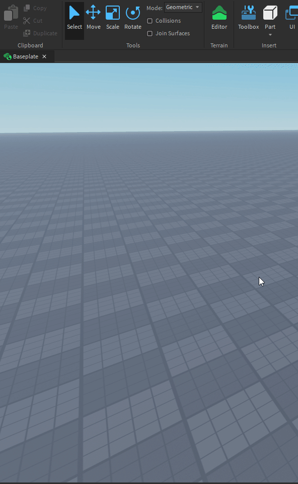
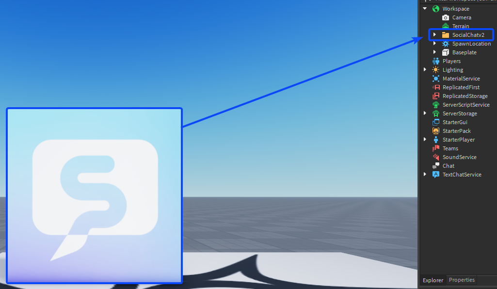
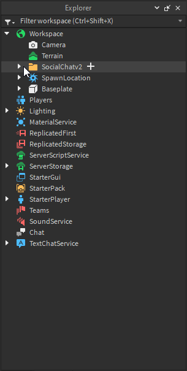
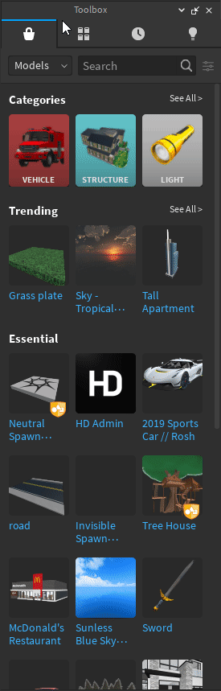
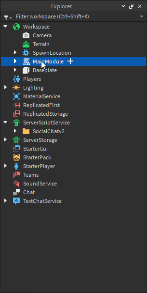
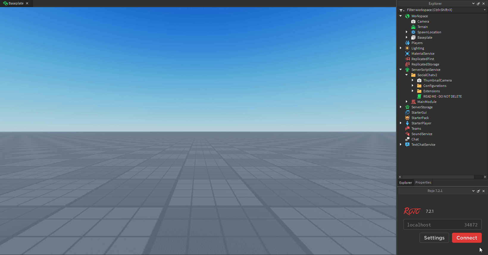

# Installation

Ready to get started? Here's how you can install Social Chat for your game!

## Roblox Studio

If you would just like to use Social Chat and want to configure it on your own, you may get the [**`asset`**](https://create.roblox.com/marketplace/asset/13067763504/Social-Chat-v2) for quick installation! For developers who want to make internal changes to the asset, you must also get the [**`MainModule`**](https://create.roblox.com/marketplace/asset/13055300395/SocialChat-v2-Main-Module) for access to internal API methods.

:::caution DISCLAIMER
If you choose to use the MainModule directly, you will **not** receive automatic updates from the developer, and you will be **required to make edits** in the original `Configuration` script.
:::

---

 

### Setting up in Studio

After aquiring the [**`Social Chat`**](https://create.roblox.com/marketplace/asset/13067763504/Social-Chat-v2) asset, you may find it within your toolbox

:::caution
Social Chat is a resource created by [**`@Cosmental`**](https://www.roblox.com/users/876817222/profile). Any other copies that are **NOT** from Cosmental are not official releases, and may result in [backdoors](https://devforum.roblox.com/t/what-exactly-is-a-backdoor/345398/7) from malicious users.
:::

 

Insert the model into your **workspace**, you should then see a SocialChat decal and a SocialChat folder in your explorer!

> *Please note that leaving the SocialChat asset in your workspace will still work as expected.*

 

To maximize security, you should place this Folder in **ServerScriptService**.

Now you're all set and ready to use SocialChat!

---

 

### Main Module Setup

:::info
Please note that this section is **specifically** for those who plan to use the MainModule. You do not have to follow these next steps if you are **only** using the configuration asset.
:::

Similarly to the configuration folder, you must first get the [**`MainModule`**](https://create.roblox.com/marketplace/asset/13055300395/SocialChat-v2-Main-Module) on Roblox. To get started, insert the asset into your workspace by searching for it in your toolbox.

:::tip
For SocialChat v1 users, you may want to refer to the [**`SocialChat v1.1 MainModule`**](https://create.roblox.com/marketplace/asset/10571068319/SocialChat-Main-Module-v11). This does not apply to developers who want to use to most up to date version of Social Chat which is currently v2.
:::

 

After inserting the asset into your workspace, place it into **ServerScriptService** to prevent exploiters from accessing any server-code.

By default, SocialChat's configuration asset will be pre-configured to require the most recent version of the system. This must be changed if you would like to make your own internal changes to the system!

This requires a small change in the Configuration script's code. In order to get this working, you must edit the script itself, and change the `require` parameters to the MainModule's path within your explorer.

:::note
Your Path *may* be different depending on how you configure the system.
:::

:::tip
You may still access the API if you would like to make external requests by using **WaitForChild** as seen in the documentation of the system. You are NOT required to use the MainModule this way **unless** you plan on making internal changes to SocialChat.
:::

Once you have completed this step, you'll be able to freely make changes to the MainModule! 🎉

---

## Visual Studio Code

<!-- Social Chat is currently designed to support Visual Studio Code with [**`Rojo`**](https://rojo.space/). If you do not plan on working with SocialChat on Rojo, feel free to skip this explination! -->

Unfortunately, SocialChat has not *yet* been setup for Rojo/Wally. If you plan on using these tools, it is preferred that you stick with the Roblox Studio manual installation for now.

If you have feedback or want to provide help towards making this happen, feel free to reach out through our community [**`Discord`**](https://discord.com/invite/4BVYecFEzA) server!