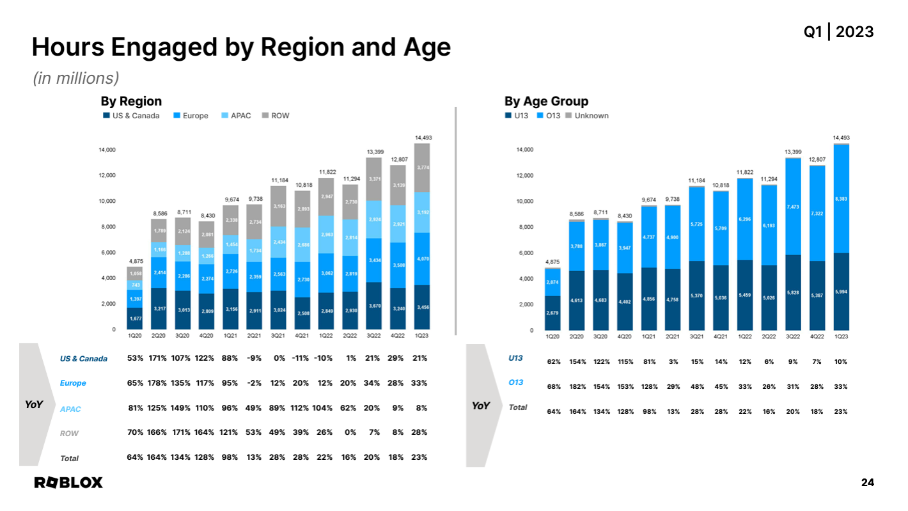
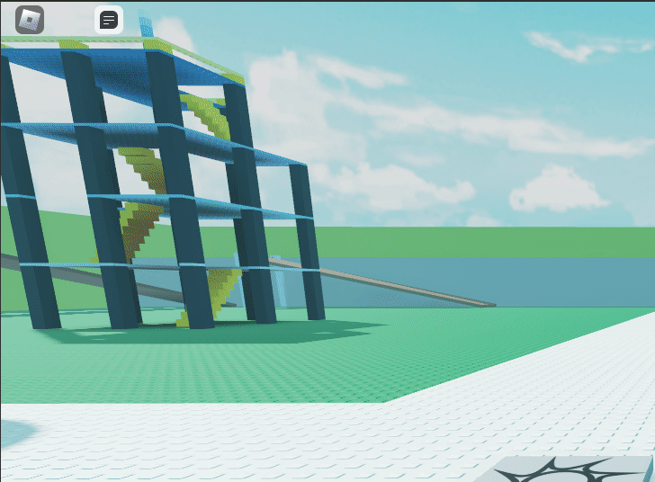
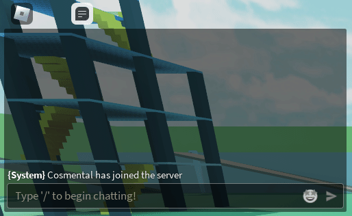

# The Problem

Roblox provides a handful of tools and resources for developers to develop new and exciting experiences using what the company provides. Many of these tools come in the form of presets that are often found in a majority of games and left unchanged. One of these presets are the Roblox Chat System.

While these presets are essential to almost every game on the platform, Roblox develops these presets with the intention of being generalized and useful for most cases which does work in many developer's favor. **However**, this generalization of experiences can often result in the same repetitive look across multiple games on the platform. While yes, you *may* edit the chat through a handful of settings that roblox provides to developers, it is currently an inconvenience to less experienced developers who may want to experiment with the chat system without knowing how.

Not only is editing the chat system more complicated than it needs to be, but it is also overlooked by developers and left in its normal state upon the release of many games. While simplicity and consistency are not always negative factors, in some cases change *can* be beneficial to a game, especially in areas where it makes **your** game stand out from others.

---

## Statistics

Roblox is an international platform with over [**`66.1 Million`**](https://www.demandsage.com/how-many-people-play-roblox/#:~:text=Currently%2C%20Roblox%20currently%20has%2066.1,we%20are%20covering%20it%20all!) active daily users (and counting)! Out of these users, an estimated [**`43.41%~` of daily users are over the age of 13**](https://s27.q4cdn.com/984876518/files/doc_financials/2023/q1/Q1-23-Supplemental-Materials-FINAL.pdf) as of **2023**. That's a large chunk of the playerbase who can most likely chat with other users!

> *Image taken from Roblox's official supplemental materials document*

 

### Why is this significant?

Older players tend to socialize more than younger players. Younger players may easily be satisfied by your game's content alone, but older players (especially at/over the age of 13) often prefer to have some sort of interaction with other players. Chatting in game is a great way to keep players engaged as it provides a sense of community.

A large chunk of your playerbase *regardless* of your intended demographic **will be able to chat** with other users. Oftentimes, players don't interact with each other because **it is not explicitly encouraged** by roblox's default chat system. Yes, the chat system *is there*, but it's features lack when it comes to encouraging players to interact with each other ***unless*** the game itself tells it's players to use the chat or collaborate with others.

---

## Our Solution

Social Chat aims to assess these issues by providing **extensions, support for emojis, and more** in the forseeable future! Here are a few examples:

### 😛 [Emojipedia](https://create.roblox.com/marketplace/asset/13055356554/Emojipedia) for Emojis

:::caution
This does not come pre-installed with SocialChat. You must install the [**extension**](https://create.roblox.com/marketplace/asset/13055356554/Emojipedia) *seperately* for your version of the resource!
:::

 

### 🌈 Chat Tag Gradients

 

### 🖥 A Control Panel

:::note
The Control Panel is an additional feature that comes pre-installed with SocialChat. You may disable it if you choose to do so.
:::